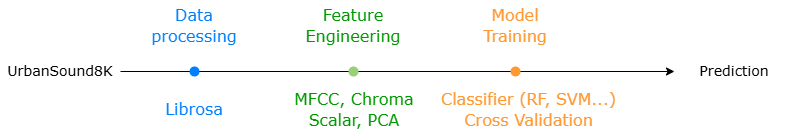

# Audio Classification with UrbanSound8K 
111062233 余承祐

## Problem Description
Urban sounds like traffic and alarms contain critical information. Sound classification supports smart monitoring and safety. **UrbanSound8K** is a public dataset of 8,732 audio snippets of urban sounds, each annotated with its corresponding class. In this project, we aim to develop a lightweight, interpretable sound classification pipeline using traditional machine learning techniques rather than DL models.

---

## Methods

We assume that
* UrbanSound8K dataset is sufficiently representative and well-labeled for training and evaluating conventional machine learning models. 
* The selected audio features contain enough discriminative information to separate sound classes without the need for deep learning.

For the training phase, we follow the dataset’s original fold split by performing 9-fold cross-validation on folds 1–9 for model selection. Fold 10 is reserved as a hold-out test set for final evaluation.

---

## Expected Results
The expectation of this project are:
* The non-DL model reaches the baseline of 60% accuracy on the test set.
* Visualize class differences using spectrograms and PCA.
* Error analysis to understand the missclassifications.

---

## References

- [UrbanSound8K Website](https://urbansounddataset.weebly.com/urbansound8k.html)
- [Kaggle](https://www.kaggle.com/datasets/chrisfilo/urbansound8k)

Salamon, J., Jacoby, C., & Bello, J. P. (2014). A dataset and taxonomy for urban sound research. 
In Proceedings of the 22nd ACM international conference on Multimedia (pp. 1041–1044).
