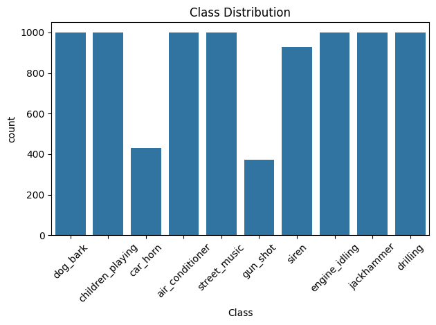
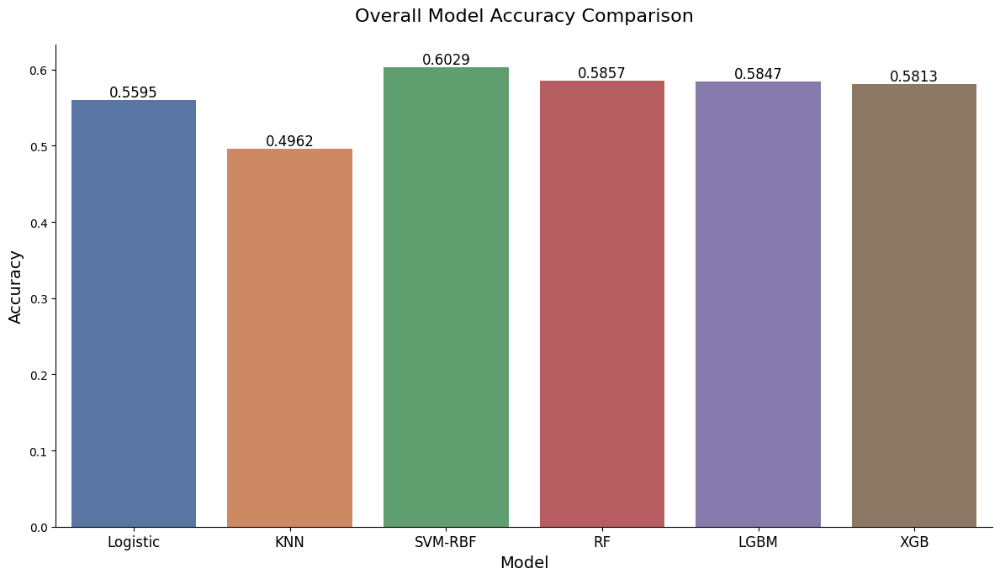
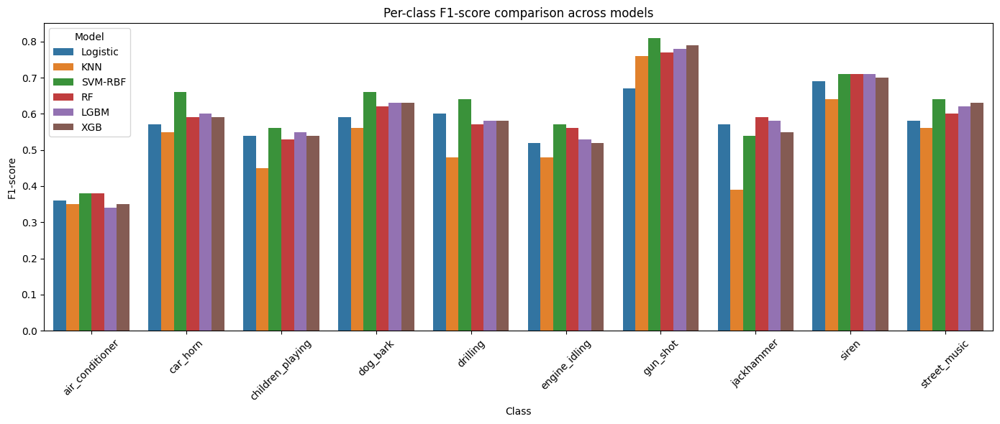
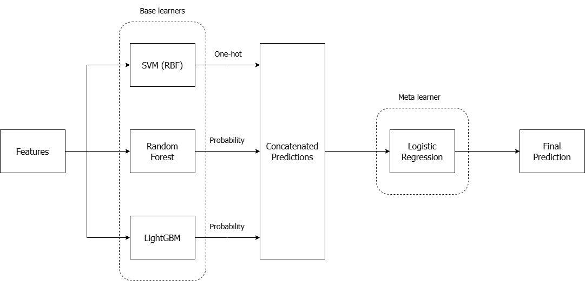
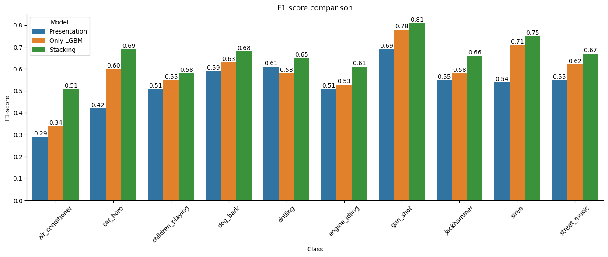
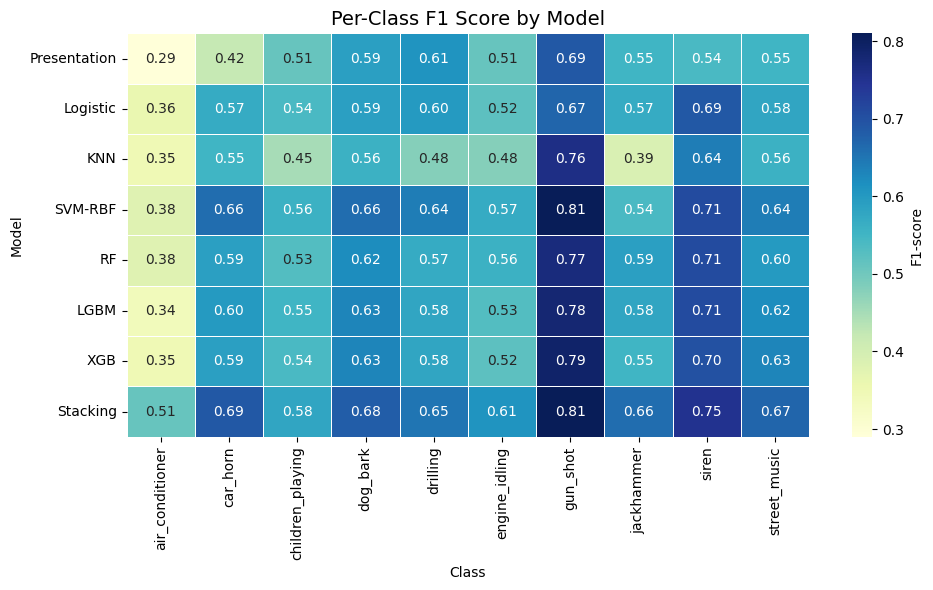

# Audio Classification with UrbanSound8K
111062233 余承祐

> The repo of project can be found in [GitHub](https://github.com/omei-Lab/UrbanSound8k-with-ML)

## Overview

In everyday life, sounds provide important contextual cues—such as siren, dog barks, or construction noise—that carry strong semantic meaning for humans. However, to machines, these are merely complex signals. By developing an Environmental Sound Classification (ESC) system, we aim to enable machines to recognize common ambient sounds, which has potential applications in smart surveillance, autonomous vehicles, and smart city systems. 

The common approach for audio classification tasks is to develop a CNN-based model, sometimes specifically referred to as an Audio Neural Network (ANN). While they are powerful, deep learning models are considered computationally expensive. We aim to explore a more lightweight and interpretable alternative by using traditional machine learning models with well-crafted audio features. 

### Workflow

Here we introduce our workflow in this project. 
1. **Data processing & Feature engineering**: 

    Raw audio files are preprocessed and transformed into structured numerical features. This includes extracting MFCCs, spectral, temporal, and chroma-based features.

2. **Model selection**: 

    Several traditional machine learning models are selected as candidates based on their performance and interpretability, including Random Forest, SVM, and Boosting.

3. **Ensemble models**: 

    A stacking ensemble strategy is applied to combine the strengths of individual models and improve overall performance.
    

---

## Introduction to UrbanSound8K

[UrbanSound8K](https://urbansounddataset.weebly.com/urbansound8k.html) is a dataset with 8732 labeled audio file, each file is shorter than 4 seconds. There are **10 classes** in the dataset.
| Label |    Class Name    | Label |   Class Name  |
|:-----:|:----------------:|:-----:|:-------------:|
|   0   |  Air conditioner |   5   | Engine Idling |
|   1   |     Car horn     |   6   |    Gun shot   |
|   2   | Children playing |   7   |   Jackhammer  |
|   3   |     Dog bark     |   8   |     Siren     |
|   4   |     Drilling     |   9   |  Street music |

The distribution of classes is shown below. Most classes contain around 1,000 samples. However, there is a noticeable imbalance in the `car_horn` and `gun_shot` classes, which each contain only about 400 samples. Also, the dataset is already splitted into **10 folds** for performing cross validation. 

---

## Data Processing & Feature Engineering

We use `librosa` to load each audio into a numeric array with the following setting:
- Sample rate: 22000 Hz (default setting).

- Target duration: 4 seconds (maximum duration among all samples).

We then extract a total of 35 audio features for each file, including:

- **MFCC** (13-dim): the timbre and spectral envelope of the sound.

- **Delta MFCC** (13-dim): the first-order derivative of MFCC, representing temporal dynamics.

- **Zero Crossing Rate (ZCR)**: how frequently the signal changes sign, often indicating noisiness.

- **RMS Energy**: the root mean square of the signal, indicating perceived loudness.

- **Spectral features** (7-dim): describe the distribution and shape of the frequency spectrum:
    - **Spectral centroid**: the center of mass of the spectrum, indicating brightness.

    - **Spectral bandwidth**: the width around the centroid, capturing frequency spread.

    - **Spectral contrast**: energy difference between peaks and valleys in the spectrum.

    - **Spectral flatness**: how much noise-like a sound is.

    - **Spectral rolloff**: the frequency below which a fixed percentage (usually 85%) of the spectral energy is contained.

    - **Chroma STFT**: pitch class energy distribution.

    - **Tonnetz**: encodes tonal relations such as harmonic and melodic intervals. 

Since different audio features vary in scale, we normalize all features using standard scaling (zero mean and unit variance). This helps improve model performance and avoids bias from dominant features. Importantly, scaling is performed separately within each fold to avoid data leakage.

---

## Model Training

To build a robust classifier, we go through two main stages: **model selection**, where we compare different machine learning algorithms, and **model tuning**, where we fine-tune each model’s hyperparameters using cross-validation. This helps us identify the most effective setup for environmental sound classification.

### Model Selection

To further improve the model performance, we'd like to adopt the stacking ensemble method, and now we will choose the candiates, start by evaluating six traditional machine learning models:
- Logistic Regression

- K-Nearest Neighbor (KNN)
- Support Vector Machine with RBF kernel (SVM-RBF)
- Random Forest (RF)
- LightGBM (LGBM)
- XGBoost (XGB)

The models are fit to the data with their default hyperparameters. Their performance will be evaluated by performing 10-fold cross validation and calculate the overall accuracy and per-class F1 score among all of the 10 validation results. The figures below show the performance across these models.
- The **overall accuracy** of each model.
    - **SVM-RBF** achieves the highest accuracy (60.3%), demonstrating strong overall predictive power.

    - **Random Forest** (58.6%) and **LightGBM** (58.5%) follow closely, indicating reliable performance.

    - **Logistic Regression**, while not the top performer (55.9%), remains a reasonable candidate for low-variance meta-learning.

    

- The **per-class F1-scores**, offering insights into how well each model handles class-wise prediction.
    - **SVM-RBF** and **tree-based models (RF, LGBM, XGB)** consistently perform well across most classes, particularly excelling on difficult classes like `gun_shot` and `siren`. The diversity in their strengths makes them ideal candidates for base learners.

    - **Logistic Regression** shows moderate but stable performance, suitable for serving as the meta-learner in stacking, where its simplicity helps to avoid overfitting when combining predictions.

    

Based on this analysis, we selected **SVM-RBF, Random Forest, and LightGBM** as base learners due to their complementary strengths and competitive individual performance. We use **Logistic Regression** as the meta-learner to combine their predictions in a robust and interpretable way.

---

## Stacking Ensemble

To further improve performance and robustness, we implemented a stacking ensemble strategy, which combines the predictions of multiple base models using a meta learner.

### Architecture

The stacking ensemble is structured in two levels:

- Level-0 (Base Learners):

    - Support Vector Machine with RBF kernel (SVM-RBF)

    - Random Forest (RF)

    - LightGBM (LGBM)

Each base model is trained independently and generates predictions (in the form of class probabilities or one-hot vectors) on the validation fold.

- Level-1 (Meta Learner):

    - Logistic Regression

The meta learner takes the outputs of the base models as input features and learns to produce the final prediction. Its simplicity helps to reduce overfitting and ensures interpretability.

### 10-fold Cross-Validation 

Since the dataset is pre-divided into 10 folds, we apply 10-fold cross-validation as follows:

1. In each fold, the base learners are trained on 9 folds and used to predict the remaining fold.

2. The predictions from all base learners are concatenated to form a new feature set.

3. he meta learner is trained on this new set of features.

4. Final performance is evaluated by aggregating predictions across all 10 folds.

This ensures that the meta learner is always trained on **out-of-fold predictions**, thus avoiding information leakage and leading to a fair evaluation.

---

## Result

The stacking ensemble achieved an overall accuracy of approximately **65%**, outperforming or matching the best individual base models. It also shows improved macro-average F1 score, indicating more balanced performance across imbalanced classes such as `car_horn` and `gun_shot`.

| Label |    Class Name    | Precision | Recall | F1-score |
|:-----:|:----------------:|:---------:|:------:|:--------:|
|   0   |  Air conditioner |    0.52   |  0.50  |   0.51   |
|   1   |     Car horn     |    0.75   |  0.64  |   0.69   |
|   2   | Children playing |    0.54   |  0.63  |   0.58   |
|   3   |     Dog bark     |    0.67   |  0.69  |   0.68   |
|   4   |     Drilling     |    0.71   |  0.61  |   0.65   |
|   5   |   Engine Idling  |    0.64   |  0.57  |   0.61   |
|   6   |     Gun shot     |    0.81   |  0.82  |   0.81   |
|   7   |    Jackhammer    |    0.63   |  0.69  |   0.66   |
|   8   |       Siren      |    0.76   |  0.74  |   0.75   |
|   9   |   Street music   |    0.65   |  0.69  |   0.67   |

### Comparison with Previous Presentation

We compare the current results with those reported in the previous presentation. The following improvements and changes have been made:

- Delta MFCC features were added to capture temporal dynamics.

- Dimensionality reduction (PCA) was removed to retain full feature information.

- A stacking ensemble method was introduced to combine multiple base models for improved performance.

To assess the effectiveness of our improvements, we compare the per-class F1 scores from three different setups:

- Presentation: The original version shown previously.

- Only LGBM: A single LightGBM classifier trained on the new feature set.

- Stacking: Our final ensemble model combining SVM, RF, and LGBM.

The following observations can be made:

- The LGBM-only model significantly improves performance over the presentation baseline in almost every class. Indicating that our feature engineering strategies are effective.

- The stacking ensemble further improves upon LGBM, showing consistent gains across nearly all categories. Notable improvements are observed in:

    - `air conditioner`: from 0.34 → 0.51

    - `dog bark`: from 0.63 → 0.68

    - `jackhammer`: from 0.58 → 0.66

    - `street music`: from 0.62 → 0.67

- Overall, the stacking model provides more balanced and higher F1 scores, especially on challenging and underrepresented classes such as car horn, gun shot, and siren.

This result supports the effectiveness of ensemble learning in aggregating diverse base learners to produce a more robust and generalizable model.

---

## Discussion

This section highlights several key observations and design choices throughout the project.

### 1. Class Imbalance

Although the dataset contains imbalance in certain classes, its impact on classification performance appears to be limited.
- `car_horn`: 429 samples.

- `gun_shot`: 374 samples.

 Interestingly, classes with relatively few samples still achieve high F1-scores. We hypothesize that this is due to their **acoustically distinctive nature**. For instance, gun shot is a short, high-energy transient sound that rarely overlaps with other ambient noises. These sounds are easy to detect even with limited training data, suggesting that intrinsic sound characteristics may mitigate the effects of class imbalance in some cases.

 ### 2. Computational Complexity Trade-off

 One of the core motivations of this project was to explore **lightweight alternatives** to deep learning (DL) models. While CNN-based architectures are standard for audio classification, they require significant computational resources and are less interpretable. In contrast, traditional machine learning (ML) models are much faster to train and easier to analyze. By applying a stacking ensemble, we found that ML models can reach comparable performance (up to 65% accuracy) while maintaining low inference cost. This presents a practical trade-off between complexity and accuracy—especially valuable in edge applications or limited-resource environments.

 ### 3. Effect of Delta MFCC

 Adding delta MFCC as additional features significantly improved model performance. These features capture the **temporal evolution of MFCCs**, which adds a dynamic aspect to the sound representation. Our experiments show consistent performance gain across multiple classes, validating the value of including temporal derivatives for better modeling of audio signals.

 ### 4. The Role of PCA

 The PCA-applied pipeline in the earlier presentation achieved lower F1-scores across most classes compared to both the LGBM-only and the stacking-based approaches without PCA. This suggests that, at least in our case, feature preservation is more beneficial than aggressive dimensionality reduction.
 - **Kernel-based**: 
 
    The kernel already performs an implicit nonlinear mapping to a higher-dimensional space, applying PCA beforehand may destroy useful nonlinear structures that help the model distinguish between classes.

 - **Tree-based**: 

    The tree-based models are naturally robust to high-dimensional and correlated features. In fact, reducing dimensionality with PCA may obscure meaningful feature splits, thus degrading the interpretability and even the performance of the model.

## Suggestions and Future Outlook

To improve model generalization and alleviate the limitation of scarce training data, we can employ various **audio data augmentation techniques** such as time stretching and background noise injection to simulate real-world acoustic variations, helping the model learn more robust and invariant features.

Additionally, for **real-time inference and deployment**, adopting a hybrid approach that combines pre-trained deep audio feature extractors with lightweight traditional classifiers can provide a good balance between accuracy and computational efficiency. This strategy enables fast prediction on resource-constrained devices, making the system practical for edge applications. Future work will focus on optimizing **feature extraction speed and reducing model complexity** to further enhance real-time responsiveness and ease of deployment.

## Appendix: Experiment Results of Models

The following hitmap shows the detailed values of per-class F1-score bwtween multiple models:

